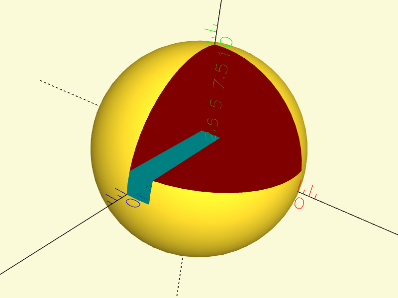
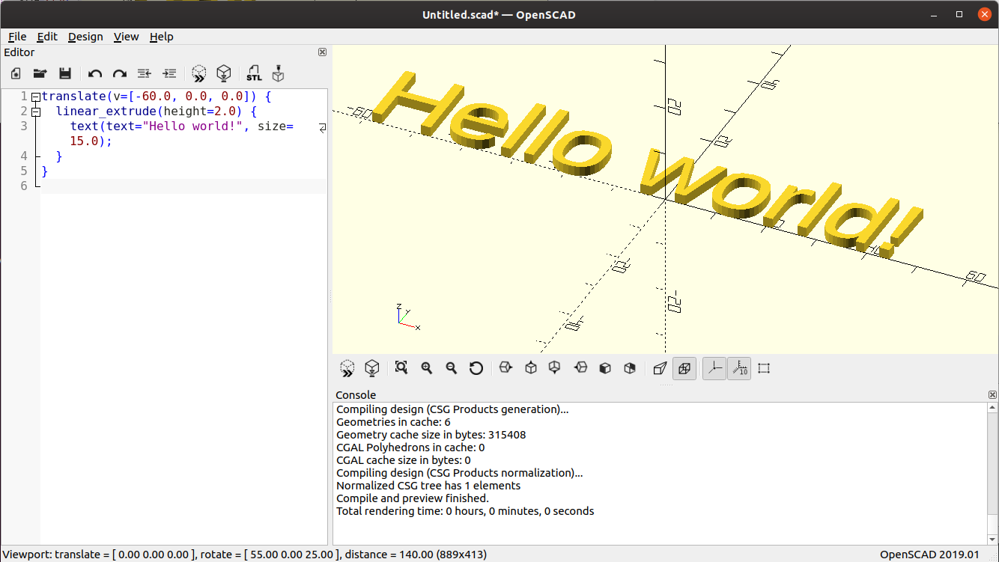

# PythonOpenScad (POSC) #

# Introduction

PythonOpenScad is a Python library for generating 3D models, primarily targeting [OpenSCAD](https://www.openscad.org/) scripts but now also supporting direct mesh generation via the [manifold3d](https://github.com/elalish/manifold) library.

The primary client for PythonOpenScad is [anchorSCAD](https://github.com/owebeeone/anchorscad), which is a library for generating models from Python code with much easier metaphors for building complex models (holes vs difference, composite shapes,
multi-material and multi-part models, path builders, and a whole lot more). PythonOpenScad aims to provide a robust API for both script generation and direct mesh manipulation.

# Installation

You can install PythonOpenScad using pip:

```bash
pip install pythonopenscad
```

Note: PythonOpenScad requires Python 3.10 or later.

# Getting Started

1. Install OpenSCAD from [openscad.org](https://openscad.org/) (Optional, if only using the pythonopenscad Manifold3D backend)
2. Install PythonOpenScad using pip: `pip install pythonopenscad`
3. Create your first model:

```python
from pythonopenscad.posc_main import posc_main, PoscModel
from pythonopenscad import PoscBase, Cube, translate, Sphere, Color
from pythonopenscad.m3dapi import M3dRenderer

# Create a simple model
def make_model() -> PoscBase:
	  return Sphere(r=10) - Color("red")(
            Cube([10, 10, 10]).translate([0, 2, 0])
        ) - Color("cyan")(Cube([2, 2, 20]))

model = make_model()
# Save to OpenSCAD file
model.write('my_model.scad')

# Render to STL
rc = model.renderObj(M3dRenderer())
rc.write_solid_stl("mystl.stl")

# Or, view the result in a 3D viewer.
posc_main([make_model])
```



Note posc_main() takes a list of model generator functions with the expectation
that your source code has functions for various models allowing for easier 
selection.

# Examples

The Python code below generates a 3D solid model of text saying 'Hello world!'. This demonstrates the [OpenPyScad](https://github.com/taxpon/openpyscad) style API. In fact, apart from the import line and conversion to string in print, this code should execute as expected using [OpenPyScad](https://github.com/taxpon/openpyscad).

```python
from pythonopenscad import Text 

print(
	Text('Hello world!', size=15).linear_extrude(height=2)
		.translate([-60, 0, 0]))
```

However, as an alternative, [SolidPython](https://github.com/SolidCode/SolidPython) style is also supported, like this.

```python
from pythonopenscad import text, linear_extrude, translate

print(
	translate(v=[-60, 0, 0]) (
		linear_extrude(height=2) (
			text(text='Hello world!', size=15)
		),
	)
)
```

The generated OpenScad code in both cases above looks like the SolidPython style code with some interesting differences, note the braces ({}) which encapsulates the list of objects that the transforms apply to.

```
// Generated OpenScad code
translate(v=[-60.0, 0.0, 0.0]) {
	linear_extrude(height=2.0) {
	text(text="Hello world!", size=15.0);
	}
}
```

Note that the OpenScad script above is all using floating point numbers. This is because PythonOpenScad converts all parameters to their corresponding expected type.

If you paste this code into OpenScad you get this:



# Modules (OpenSCAD functions) and Lazy Unions

Lazy union is the implicit union for the top level node. This is an experimental feature in OpenSCAD to render multi-component models to a 3mf file. PythonOpenScad supports this feature with `LazyUnion` but it needs to be the top level node. Also, in order
to reduce duplication of code, the `Module` class will replace a tree with a module call and place the module code at a lower level in the script.

```python
from pythonopenscad import LazyUnion, Module, Text, Translate

thing1 = Text("Hello world!", size=15).linear_extrude(height=2).translate([-60, 20, 0])
thing2 = Text("Hello world 2!", size=15).linear_extrude(height=2).translate([-60, 0, 0])
print(
    LazyUnion()(
        Module("my_module")(thing1),
		Module("my_module")(thing2),
        Translate(v=[0, -40, 0])(Module("my_module")(thing1)),
    )
)
```

Module names are generated by comparing the node (deep compare) so even if the module names are the same, a different module name will be generated for each distinct graph.

This below is the generated OpenSCAD code. Notice that the module name for thing2 is `my_module_1` and the module name for thing1 is `my_module` even though they are created in the same name. Name collisions are resolved by appending an underscore and a number to the module name. :

```
// Start: lazy_union
my_module();
my_module_1();
translate(v=[0.0, -40.0, 0.0]) {
  my_module();
}
// End: lazy_union

// Modules.

module my_module() {
  translate(v=[-60.0, 20.0, 0.0]) {
    linear_extrude(height=2.0) {
      text(text="Hello world!", size=15.0);
    }
  }
} // end module my_module

module my_module_1() {
  translate(v=[-60.0, 0.0, 0.0]) {
    linear_extrude(height=2.0) {
      text(text="Hello world 2!", size=15.0);
    }
  }
} // end module my_module_1
```

Notably, the module functionality is used by AnchorScad for managing multi material and multi part models. Each part/material pair will result in a module. When assembling a model, AnchorScad will combine these modules to respect the material and part priorities which can result in significant code reduction by removing duplicate code, not to mention the readability improvements.

# Features

The best things come for free. You're free to use your favorite Python IDE and get all the goodness of a full IDE experience. What doesn't come for free but is very useful is listed below:

* All POSC constructors are type-checked. No generated scripts with junk inside them that's hard to trace, and full debugger support comes for free.

* Supports both [OpenPyScad](https://github.com/taxpon/openpyscad) and [SolidPython](https://github.com/SolidCode/SolidPython) APIs for generating OpenScad code. Some differences exist between them in how the final model looks.

* **New:** Direct mesh generation using the [manifold3d](https://github.com/elalish/manifold) backend, allowing export to formats like STL without requiring OpenSCAD.
    * Note: The manifold3d backend currently does not implement `minkowski()`, `import()`, or `surface()`.

* **New:** Includes a simple viewer and a `posc_main` helper function to quickly view models from your scripts (see `pythonopenscad/posc_main.py` and `pythonopenscad/examples/primitive_viewer_example.py`).

* Flexible code dump API to make it easy to add new functionality if desired.

* POSC PyDoc strings have URLs to all the implemented primitives. 

* Best of all, it does nothing else. Consider it a communication layer to OpenScad. Other functionality should be built as separate libraries.

## POSC Compatibility with the [OpenPyScad](https://github.com/taxpon/openpyscad) and [SolidPython](https://github.com/SolidCode/SolidPython) APIs

Each POSC object contains member functions for all the OpenScad transformations. (Note: these functions are simply wrapper functions over the transformation class constructors.) This API style is more traditional for solid modeling APIs. However, the POSC implementation gives no preference between either style, and objects created with one API can be mixed and matched with objects created using the other API. All the [OpenPyScad](https://github.com/taxpon/openpyscad) equivalent classes have capitalized names, while the [SolidPython](https://github.com/SolidCode/SolidPython) classes have lowercase names (the classes are different but they can be compared for equality). For example:

```
	>>> from pythonopenscad import Text, text
	>>> Text() == text()
	True
	>>> Text('a') == text()
	False
```

[OpenPyScad](https://github.com/taxpon/openpyscad)'s modifier interface is not implemented but a different PythonOpenScad specific API accomplishes the same function. Modifiers are flags. In PythonOpenScad There are 4 flags, DISABLE, SHOW_ONLY, DEBUG and TRANSPARENT. They can be added and removed with the add_modifier, remove_modifier and has_modifiers functions.

# License

PythonOpenSCAD is available under the terms of the [GNU LESSER GENERAL PUBLIC LICENSE](https://www.gnu.org/licenses/old-licenses/lgpl-2.1.en.html#SEC1).

Copyright (C) 2025 Gianni Mariani

[PythonOpenScad](https://github.com/owebeeone/pythonopenscad) is free software; 
you can redistribute it and/or modify it under the terms of the GNU Lesser General Public
License as published by the Free Software Foundation; either
version 2.1 of the License, or (at your option) any later version.

This library is distributed in the hope that it will be useful,
but WITHOUT ANY WARRANTY; without even the implied warranty of
MERCHANTABILITY or FITNESS FOR A PARTICULAR PURPOSE.  See the GNU
Lesser General Public License for more details.

You should have received a copy of the GNU Lesser General Public
License along with this library; if not, write to the Free Software
Foundation, Inc., 51 Franklin Street, Fifth Floor, Boston, MA  02110-1301  USA

## Why Yet Another OpenScad Script Generator?

I mainly wanted more functionality that was not being offered, and it didn't seem OpenPyScad (my preferred style) was pulling changes very quickly. (As luck would have it, my small pull request was published about the same time I got PythonOpenScad working to a sufficiently stable state.) I really wanted type checking/conversion and more comprehensive PyDoc documentation.

Apart from that, it seems that using Python to produce 3D solid models using OpenScad is a prestigious line of work with a long and glorious tradition.

Here are some:

[https://github.com/SolidCode/SolidPython](https://github.com/SolidCode/SolidPython) active

[https://github.com/taxpon/openpyscad](https://github.com/taxpon/openpyscad) (kind of active)

[https://github.com/SquirrelCZE/pycad/](https://github.com/SquirrelCZE/pycad/) (gone)

[https://github.com/vishnubob/pyscad](https://github.com/vishnubob/pyscad) (2016)

[https://github.com/bjbsquared/SolidPy](https://github.com/bjbsquared/SolidPy) (2012)

[https://github.com/acrobotic/py2scad](https://github.com/acrobotic/py2scad) (2015)

[https://github.com/TheZoq2/py-scad](https://github.com/TheZoq2/py-scad) (2015)

[https://github.com/defnull/pyscad](https://github.com/defnull/pyscad) (2014)

It also seems like lots of dead projects but a popular theme nonetheless.

Given there are 2 active projects the big difference seems to be the API. [SolidPython](https://github.com/SolidCode/SolidPython) seems to mimic OpenScad like syntax (e,g, translate(v)cube()) while [OpenPyScad](https://github.com/taxpon/openpyscad) employs a more common syntax (e.g. cube().translate()).

[SolidPython](https://github.com/SolidCode/SolidPython) appears to be much more active than [OpenPyScad](https://github.com/taxpon/openpyscad) and contains a number of interesting enhancements with the inclusion of "holes". This can be positive or negative, I think negative. Personally I'd prefer another totally separate API layer that has much richer support and distances itself from the OpenScad api entirely.

So why did I write PythonOpenScad? I really don't like the OpenScad syntax and I wanted a bit more error checking and flexibility with the supported data types. [OpenPyScad](https://github.com/taxpon/openpyscad) could be a whole lot better and it seems like it needs a bit of a rewrite. It still supports Python 2 (and 3) but I wanted to move on.

PythonOpenScad provides a layer to generate OpenScad scripts or directly manipulate 3D meshes using Manifold3D. I will only entertain features that are specific to supporting OpenScad compatibility or Manifold3D integration in PythonOpenScad. PythonOpenScad supports both the [SolidPython](https://github.com/SolidCode/SolidPython) and [OpenPyScad](https://github.com/taxpon/openpyscad) solid modelling API styles.

* Parameters are checked or converted and will raise exceptions if parameters are incompatible.

* OpenScad defaults are applied so getting attribute values will result in actual values.

* Documentation links to OpenScad reference docs can be found from help(object).

* $fn/$fa/$fs is supported everywhere it actually does something even though the docs don't say that they do.

* repr(object) works and produces python code. similarly str(object) produces OpenScad code.

PythonOpenScad code aims to provide a robust interface for solid modeling in Python, whether targeting OpenSCAD or direct mesh generation.

I am building another solid modelling tool, [AnchorScad](https://github.com/owebeeone/anchorscad) which allows building libraries of geometric solid models that will hopefully be a much easier way to build complex models. This is a layer on top of other CSG modules that hopefully will have an independent relationship with OpenScad.


# Contributing

Contributions are welcome! Please feel free to submit a Pull Request.

Please make sure to update tests as appropriate.
