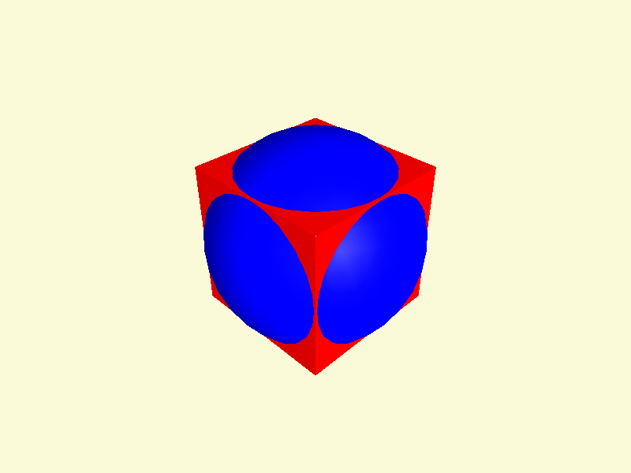
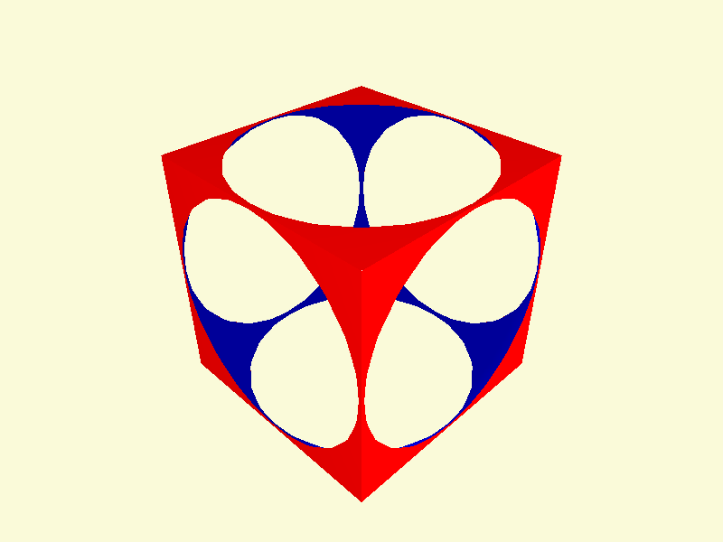
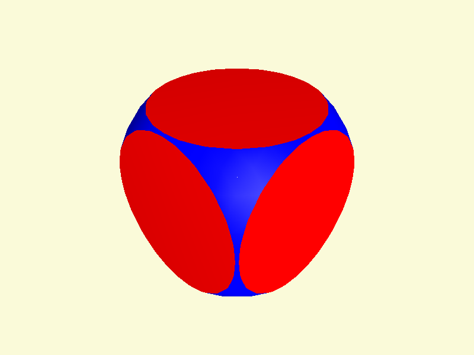
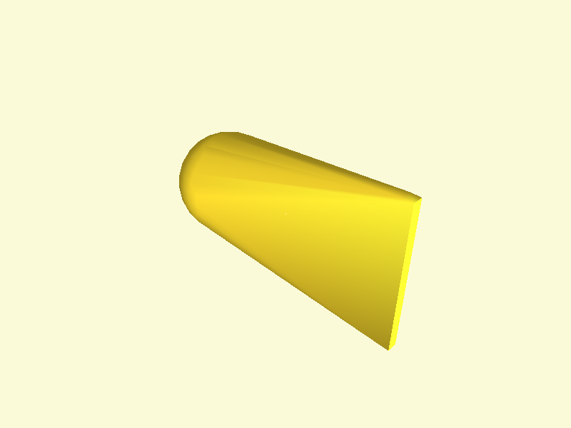

# CSG Modelling

These gists demonstrate the use of CSG operations to create complex shapes.

## Union
    
### Python Code:
```python
from pythonopenscad import Color, Cube, Sphere, Translate, Union

MODEL = Union()(
    Color("red")(Cube(10)),
    Color("blue")(Translate([5,5,5])(Sphere(r=7)))
)
```
    
### OpenSCAD Code:
```js
union() {
  color(c="red") {
    cube(size=10.0);
  }
  color(c="blue") {
    translate(v=[5.0, 5.0, 5.0]) {
      sphere(r=7.0);
    }
  }
}

```
    
### How to run this example in a viewer:
```bash
python -m pythonopenscad.examples.gists_csg.union_functional --view
```

### Image:

     
## Union
    
### Python Code:
```python
from pythonopenscad import Color, Cube, Sphere, Translate

MODEL = Color('red')(Cube(10)) + Color('blue')(Translate([5,5,5])(Sphere(r=7)))
```
    
### OpenSCAD Code:
```js
union() {
  color(c="red") {
    cube(size=10.0);
  }
  color(c="blue") {
    translate(v=[5.0, 5.0, 5.0]) {
      sphere(r=7.0);
    }
  }
}

```
    
### How to run this example in a viewer:
```bash
python -m pythonopenscad.examples.gists_csg.union_operator --view
```

### Image:

     
## Difference
    
### Python Code:
```python
from pythonopenscad import Color, Cube, Difference, Sphere

MODEL = Difference()(
    Color("red")(Cube(10, center=True)),
    Color("blue")(Sphere(r=7))
)
```
    
### OpenSCAD Code:
```js
difference() {
  color(c="red") {
    cube(size=10.0, center=true);
  }
  color(c="blue") {
    sphere(r=7.0);
  }
}

```
    
### How to run this example in a viewer:
```bash
python -m pythonopenscad.examples.gists_csg.difference_functional --view
```

### Image:

     
## Difference
    
### Python Code:
```python
from pythonopenscad import Color, Cube, Sphere

MODEL = Color('red')(Cube(10, center=True)) - Color('blue')(Sphere(r=7))
```
    
### OpenSCAD Code:
```js
difference() {
  color(c="red") {
    cube(size=10.0, center=true);
  }
  color(c="blue") {
    sphere(r=7.0);
  }
}

```
    
### How to run this example in a viewer:
```bash
python -m pythonopenscad.examples.gists_csg.difference_operator --view
```

### Image:

     
## Intersection
    
### Python Code:
```python
from pythonopenscad import Color, Cube, Intersection, Sphere

MODEL = Intersection()(
    Color("red")(Cube(10, center=True)),
    Color("blue")(Sphere(r=7))
)
```
    
### OpenSCAD Code:
```js
intersection() {
  color(c="red") {
    cube(size=10.0, center=true);
  }
  color(c="blue") {
    sphere(r=7.0);
  }
}

```
    
### How to run this example in a viewer:
```bash
python -m pythonopenscad.examples.gists_csg.intersection_functional --view
```

### Image:

     
## Intersection
    
### Python Code:
```python
from pythonopenscad import Color, Cube, Sphere

MODEL = Color('red')(Cube(10, center=True)) * Color('blue')(Sphere(r=7))
```
    
### OpenSCAD Code:
```js
intersection() {
  color(c="red") {
    cube(size=10.0, center=true);
  }
  color(c="blue") {
    sphere(r=7.0);
  }
}

```
    
### How to run this example in a viewer:
```bash
python -m pythonopenscad.examples.gists_csg.intersection_operator --view
```

### Image:

     
## Hull
    
### Python Code:
```python
from pythonopenscad import Color, Cube, Hull, Sphere, Translate

MODEL = Hull()(
    Color("red")(Translate([-10,0,0])(Sphere(r=5))),
    Color("blue")(Translate([10,0,0])(Cube([1,1,15], center=True)))
)
```
    
### OpenSCAD Code:
```js
hull() {
  color(c="red") {
    translate(v=[-10.0, 0.0, 0.0]) {
      sphere(r=5.0);
    }
  }
  color(c="blue") {
    translate(v=[10.0, 0.0, 0.0]) {
      cube(size=[1.0, 1.0, 15.0], center=true);
    }
  }
}

```
    
### How to run this example in a viewer:
```bash
python -m pythonopenscad.examples.gists_csg.hull_example --view
```

### Image:

     
## Minkowski
    
### Python Code:
```python
from pythonopenscad import Circle, Minkowski, Square

MODEL = Minkowski()(Square([10, 2]), Circle(r=2))
```
    
### OpenSCAD Code:
```js
minkowski() {
  square(size=[10.0, 2.0]);
  circle(r=2.0);
}

```
    
### How to run this example in a viewer:
```bash
python -m pythonopenscad.examples.gists_csg.minkowski_example --view
```

### Image:

     
