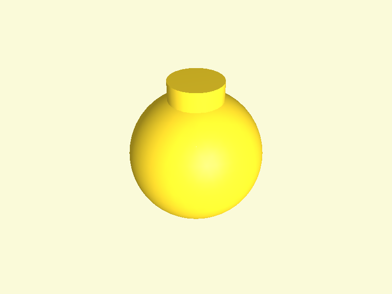
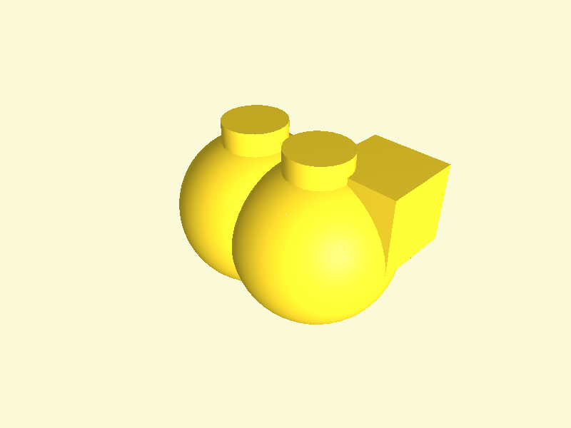
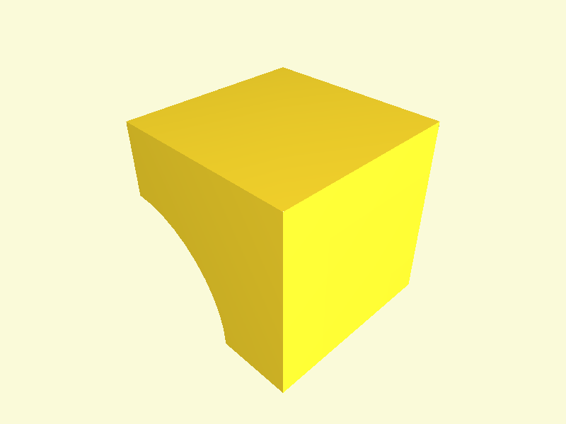
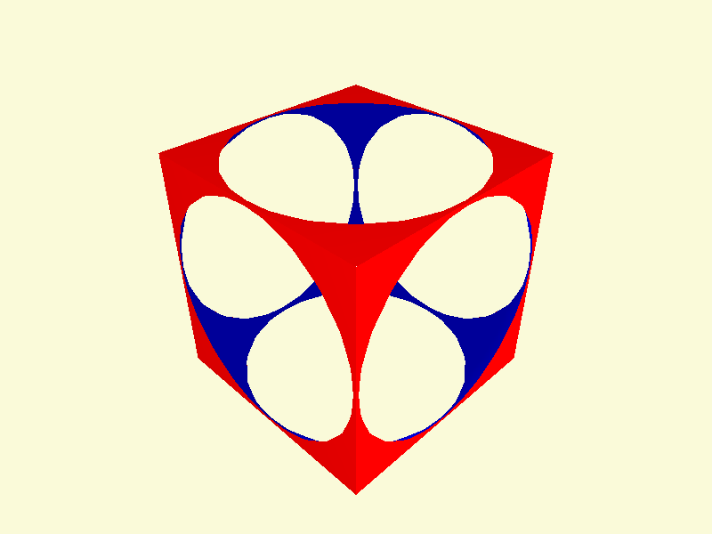
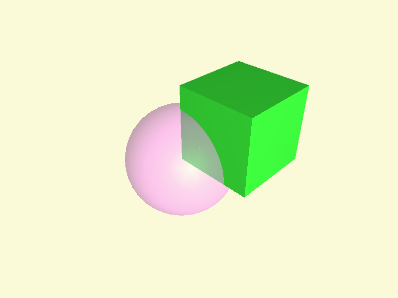
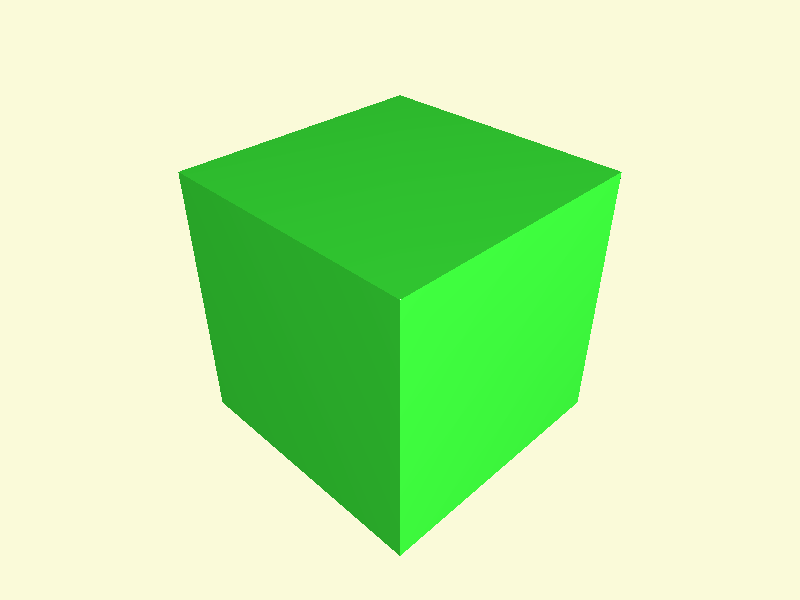
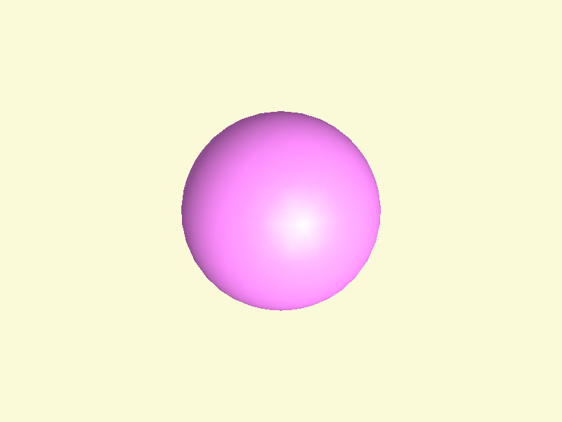
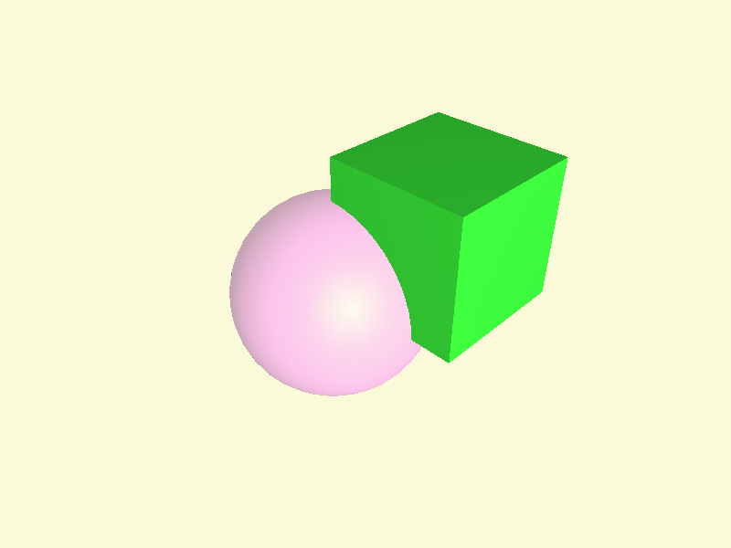

# Other Features

These gists demonstrate other features of the pythonopenscad library.

## Global Variables
    
### Python Code:
```python
from pythonopenscad import Cylinder, POSC_GLOBALS, Sphere

POSC_GLOBALS._fn = 50
MODEL = Sphere(r=10) + Cylinder(h=12, r=4)
```
    
### OpenSCAD Code:
```js
$fn = 50;

union() {
  sphere(r=10.0);
  cylinder(h=12.0, r=4.0, center=false);
}

```
    
### How to run this example in a viewer:
```bash
python -m pythonopenscad.examples.gists_other.global_variables_example --view
```

### Image:

     
## Modules
    
### Python Code:
```python
from pythonopenscad import Cube, Cylinder, LazyUnion, Module, Sphere, Translate

MODEL = LazyUnion()(
    Module("my_module")(Sphere(r=10), Cylinder(h=12, r=4)),
    Module("my_other_module")(
        Translate([10, 0, 0])(Cube(10),
        Module("my_module")(Sphere(r=10), Cylinder(h=12, r=4)))
    )
)

# Notice the openscad version of this code only shows up once:
#     Module("my_module")(Sphere(r=10), Cylinder(h=12, r=4))
# This allows for more compact code and less duplicated processing.
```
    
### OpenSCAD Code:
```js
// Start: lazy_union
my_module();
my_other_module();
// End: lazy_union

// Modules.

module my_module() {
  sphere(r=10.0);
  cylinder(h=12.0, r=4.0, center=false);
} // end module my_module

module my_other_module() {
  translate(v=[10.0, 0.0, 0.0]) {
    cube(size=10.0);
    my_module();
  }
} // end module my_other_module

```
    
### How to run this example in a viewer:
```bash
python -m pythonopenscad.examples.gists_other.modules_example --view
```

### Image:

     
## Render
    
### Python Code:
```python
from pythonopenscad import Cube, Difference, Render, Sphere

MODEL = Render(convexity=10)(Difference()(Cube(10), Sphere(r=6)))
```
    
### OpenSCAD Code:
```js
render(convexity=10) {
  difference() {
    cube(size=10.0);
    sphere(r=6.0);
  }
}

```
    
### How to run this example in a viewer:
```bash
python -m pythonopenscad.examples.gists_other.render_example --view
```

### Image:

     
## Snake Case Style
    
### Python Code:
```python
from pythonopenscad import color, cube, difference, sphere

MODEL = difference()(
    color("red")(cube(10, center=True)),
    color("blue")(sphere(r=7))
)
```
    
### OpenSCAD Code:
```js
difference() {
  color(c="red") {
    cube(size=10.0, center=true);
  }
  color(c="blue") {
    sphere(r=7.0);
  }
}

```
    
### How to run this example in a viewer:
```bash
python -m pythonopenscad.examples.gists_other.snake_case_style_example --view
```

### Image:

     
## Background Modifier (%)
    
### Python Code:
```python
from pythonopenscad import BACKGROUND, Color, Cube, Sphere

MODEL = Color("limegreen")(Cube(10)) - Color("violet")(Sphere(r=7)).add_modifier(BACKGROUND)
```
    
### OpenSCAD Code:
```js
difference() {
  color(c="limegreen") {
    cube(size=10.0);
  }
  %color(c="violet") {
    sphere(r=7.0);
  }
}

```
    
### How to run this example in a viewer:
```bash
python -m pythonopenscad.examples.gists_other.modifier_background_example --view
```

### Image:

     
## Disable Modifier (*)
    
### Python Code:
```python
from pythonopenscad import Color, Cube, DISABLE, Sphere

MODEL = Color("limegreen")(Cube(10)) + Color("violet")(Sphere(r=7)).add_modifier(DISABLE)
```
    
### OpenSCAD Code:
```js
union() {
  color(c="limegreen") {
    cube(size=10.0);
  }
  *color(c="violet") {
    sphere(r=7.0);
  }
}

```
    
### How to run this example in a viewer:
```bash
python -m pythonopenscad.examples.gists_other.modifier_disable_example --view
```

### Image:

     
## Show Only Modifier (!)
    
### Python Code:
```python
from pythonopenscad import Color, Cube, SHOW_ONLY, Sphere

MODEL = Color("limegreen")(Cube(10)) + Color("violet")(Sphere(r=7)).add_modifier(SHOW_ONLY)
```
    
### OpenSCAD Code:
```js
union() {
  color(c="limegreen") {
    cube(size=10.0);
  }
  !color(c="violet") {
    sphere(r=7.0);
  }
}

```
    
### How to run this example in a viewer:
```bash
python -m pythonopenscad.examples.gists_other.modifier_show_only_example --view
```

### Image:

     
## Debug Modifier (#)
    
### Python Code:
```python
from pythonopenscad import Color, Cube, DEBUG, Sphere

MODEL = Color("limegreen")(Cube(10)) + Color("violet")(Sphere(r=7)).add_modifier(DEBUG)
```
    
### OpenSCAD Code:
```js
union() {
  color(c="limegreen") {
    cube(size=10.0);
  }
  #color(c="violet") {
    sphere(r=7.0);
  }
}

```
    
### How to run this example in a viewer:
```bash
python -m pythonopenscad.examples.gists_other.modifier_debug_example --view
```

### Image:

     
## Combine Modifiers (# %)
    
### Python Code:
```python
from pythonopenscad import BACKGROUND, Color, Cube, DEBUG, Sphere

MODEL = Color("limegreen")(Cube(10)) + Color("violet")(Sphere(r=7)).add_modifier(DEBUG, BACKGROUND)
```
    
### OpenSCAD Code:
```js
union() {
  color(c="limegreen") {
    cube(size=10.0);
  }
  #%color(c="violet") {
    sphere(r=7.0);
  }
}

```
    
### How to run this example in a viewer:
```bash
python -m pythonopenscad.examples.gists_other.modifier_combinations_example --view
```

### Image:

     
